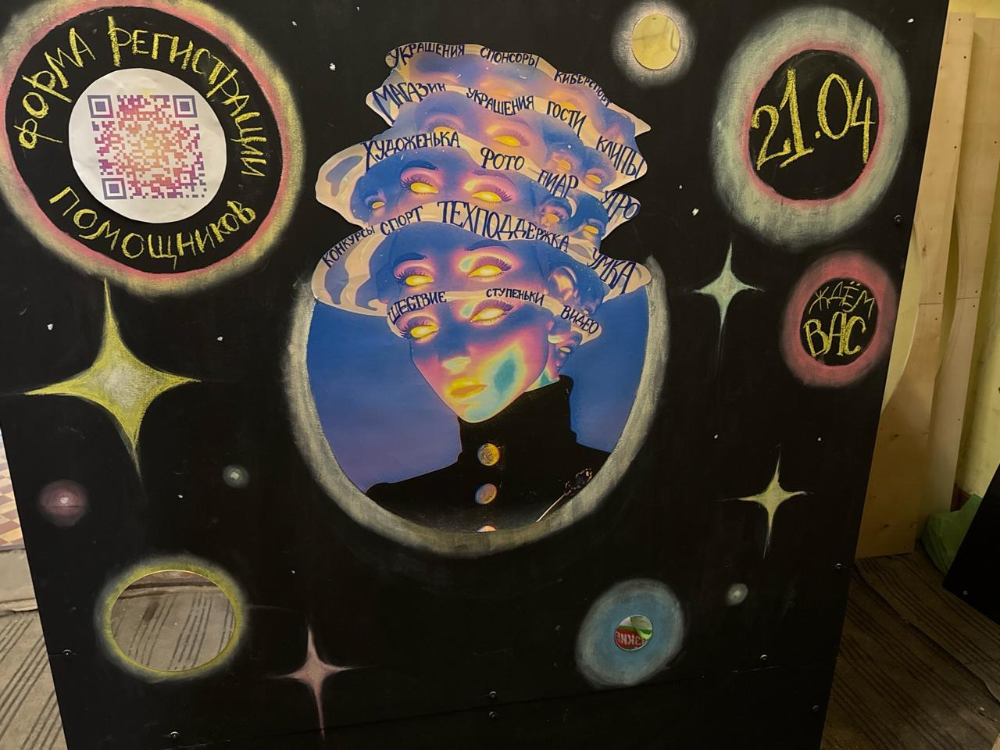
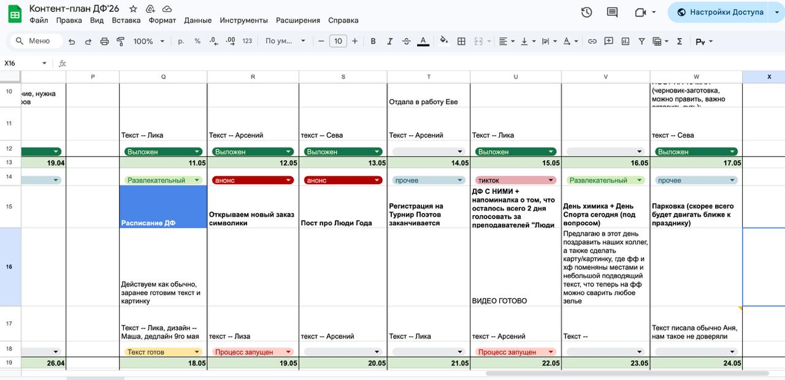
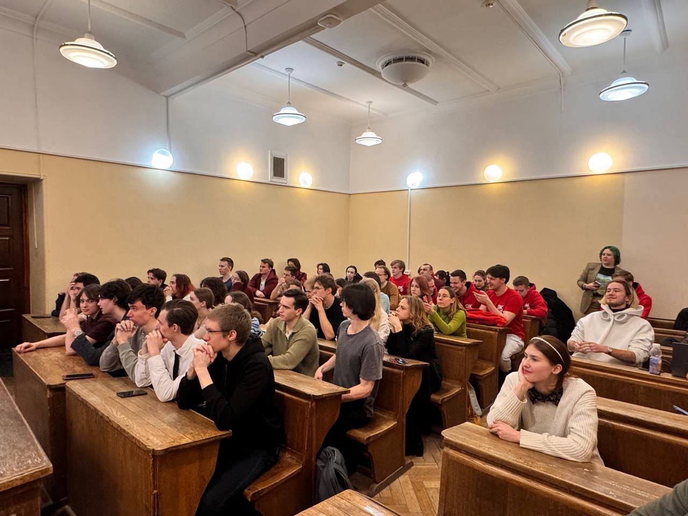
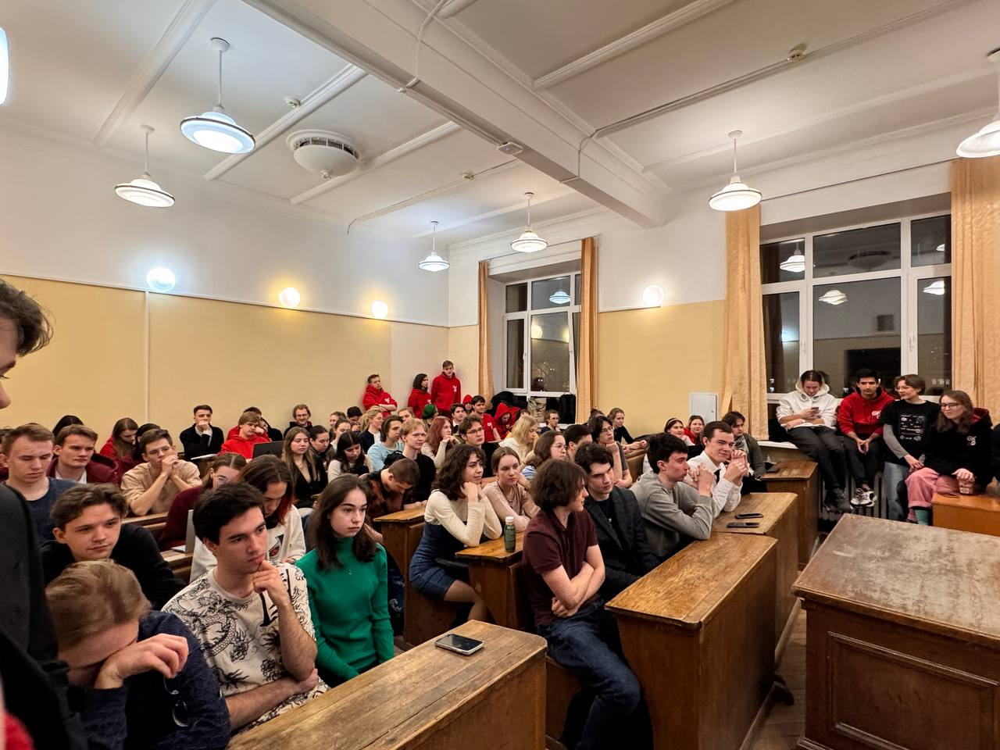
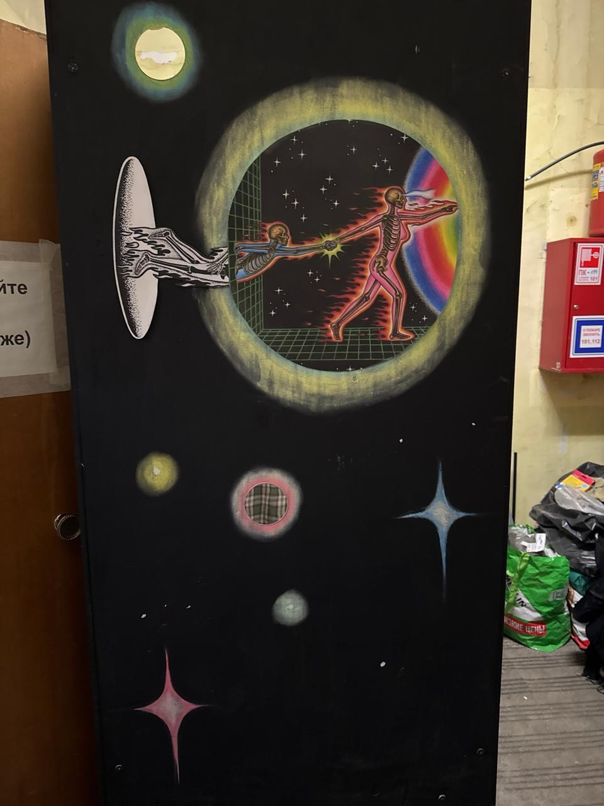
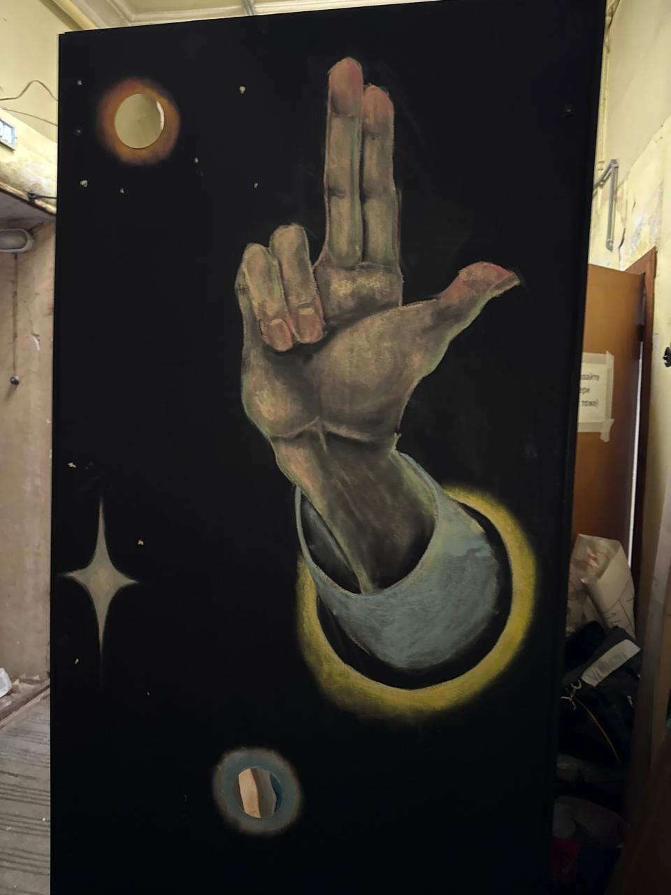
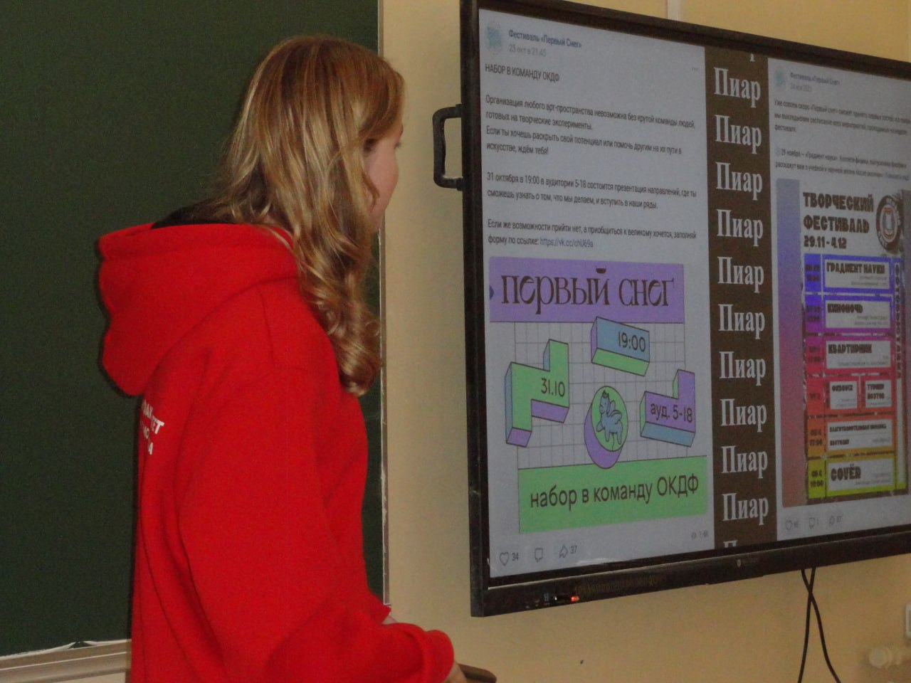
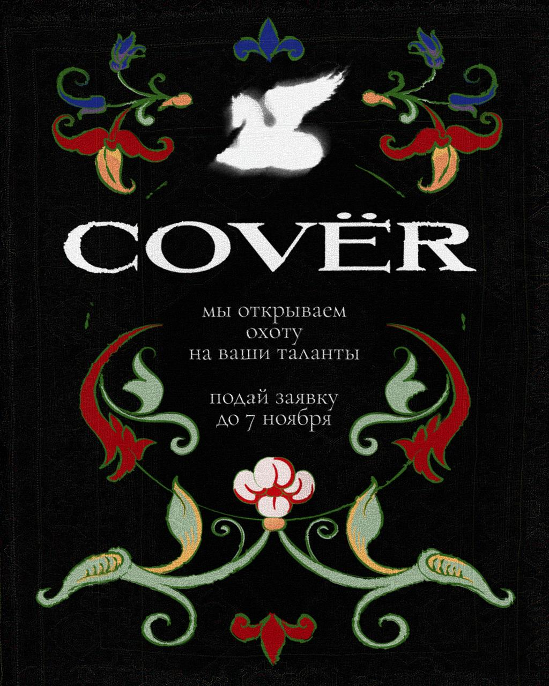
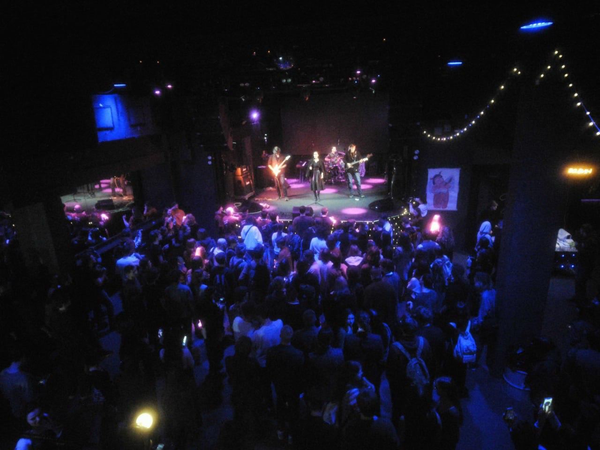

# Елизавета Вершинина

## SMM-специалист и PR-менеджер

Начинающий специалист в сфере коммуникаций и контента с опытом разработки PR-стратегий, контент-планов, подготовки текстовых и визуальных материалов, презентаций и аналитики вовлеченности. Работаю с сообществами, мероприятиями и образовательными проектами: от идеи и упаковки до публикаций, отчетности и обратной связи.

**Опыт:** 2,5 года  
**Образование:** МГУ имени М. В. Ломоносова, с сентября 2022 года  
**Фокус:** SMM, PR, копирайтинг, мероприятия, студенческие медиа, аналитика

## Сообщества и проекты

- [День физика МГУ во ВКонтакте](https://vk.com/df_msu)
- [День физика МГУ в Telegram](https://t.me/df_msu)
- [Open FF в Telegram](https://t.me/open_ff)
- [Open Phys во ВКонтакте](https://vk.com/open.phys)
- [Личный Telegram](https://t.me/louisverssh)

## Ключевой опыт

### ПАО Сбербанк, Центр робототехники

**Стажер-маркетолог**  
Ноябрь 2025 года - настоящее время

- Разработка концепции внутренних мероприятий для команды.
- Организация и сопровождение мероприятий.
- Создание презентаций и отчетных материалов по итогам демонстраций.
- Координация взаимодействия со спикерами.

### Организационный комитет Дня физика

**Руководитель направления PR**  
Апрель 2023 года - настоящее время

- Разработка PR-стратегии для продвижения мероприятий с охватом более 1500 участников.
- Управление командой из 15 человек: распределение задач, контроль исполнения, организационные и креативные собрания.
- Формирование контент-плана, написание постов и пресс-релизов.
- Организация переговоров со спонсорами.
- Анализ эффективности публикаций: охваты, вовлеченность, реакция аудитории.
- Анализ трендов и адаптация коммуникации под повестку проекта.
- Развитие и модерирование сообществ во ВКонтакте и Telegram с аудиторией около 9000 человек.

### Приемная комиссия МГУ имени М. В. Ломоносова

**Руководитель SMM-отдела по работе с абитуриентами**  
Июнь 2024 года - настоящее время

- Продвижение университета в социальных сетях.
- Съемка развлекательного и информационного контента для абитуриентов.
- Написание постов, работа с темами поступления и университетской жизни.
- Взаимодействие с представителями телевидения.
- Составление контент-плана в Google Таблицах для ВКонтакте и Telegram.
- Генерация идей для коротких роликов и TikTok-форматов.
- Использование GigaChat для генерации и модерации постов.
- Анализ целевой аудитории.
- Подготовка презентаций в PowerPoint для отчетов руководству.
- Контроль выхода постов и статей под редакцией пресс-службы МГУ.
- Сбор команды для съемок видеороликов.

### Научно-технологический марафон «Неделя Атома»

**Редактор**  
Март 2025 года - май 2025 года

- Сбор и структурирование информации для постов и материалов.
- Формирование контент-плана.
- Анализ откликов и вовлеченности.

## Навыки

- Организация и проведение мероприятий онлайн и офлайн.
- Коммуникация, переговоры, деловая переписка и управление командой.
- PowerPoint, Word, Canva, Figma на продвинутом уровне.
- Публичные выступления.
- Копирайтинг: письма, посты, описания мероприятий, пресс-релизы.
- Оценка эффективности публикаций: охваты, конверсия, вовлеченность.
- Бартерные коллаборации и партнерские публикации в студенческих медиа.
- Работа с журналистами и подготовка статей для вузовских СМИ.

## Кейсы и визуальные материалы

### День физика: коммуникация, команда и офлайн

Контент и PR для Дня физика объединяли несколько задач: прогрев аудитории, анонсы, визуальную айдентику, навигацию по активностям и поддержку офлайн-сценария мероприятия.

  
  

  
  

### Визуальная среда мероприятия

Часть PR-работы была связана не только с публикациями, но и с созданием узнаваемой среды: стендов, визуальных точек, оформительских решений и материалов для навигации внутри события.

  
  
  

### Фестиваль «Первый снег» и проект Cover

В материалах проекта видна работа с афишами, набором участников, визуальным стилем и продвижением музыкального события: от онлайн-анонсов до печатных материалов и финального офлайн-мероприятия.

  
  
  

## Что могу взять на себя

- SMM-сопровождение проекта или мероприятия.
- Разработку контент-плана и рубрикатора.
- Написание постов, пресс-релизов, анонсов и текстов для партнеров.
- Координацию небольшой PR- или контент-команды.
- Подготовку презентаций, отчетов и визуальных материалов.
- Анализ метрик и формирование рекомендаций по развитию коммуникации.

